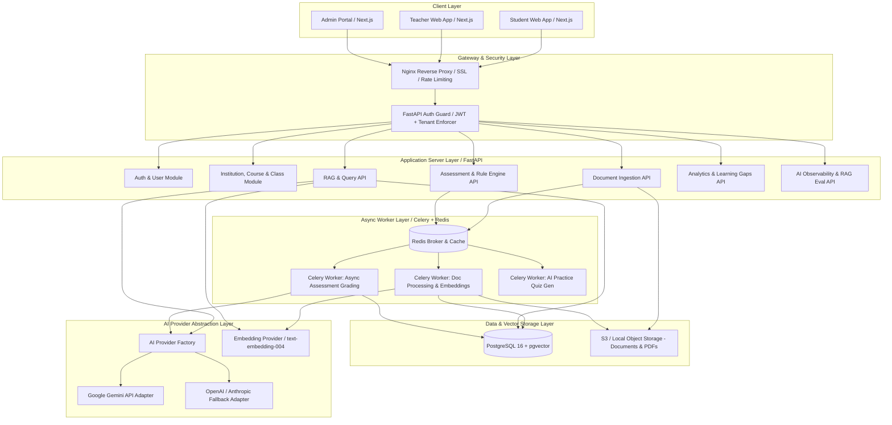

# Smart Academic AI - System Architecture Document

## 1. System Overview

**Smart Academic AI** is a production-grade multi-tenant academic intelligence and personalized learning platform. It empowers educational institutions by combining academic document intelligence, Retrieval-Augmented Generation (RAG), deterministic analytics, hybrid AI rule engines, and automated assessment and intervention workflows.

### Core Value Proposition
- **Multi-Tenant Isolation**: Strict logical data separation per educational institution derived from JWT token context (`TenantContext`).
- **Academic Document Intelligence**: Seamless ingestion, chunking, vector indexing, and citation-backed RAG over course materials.
- **Hybrid Evaluation Engine**: Deterministic scoring and topic mapping coupled with LLM-powered feedback and personalized practice quiz generation.
- **Async Job Architecture**: Heavy operations (document ingestion, PDF parsing, bulk grading, embedding generation, practice quiz generation) execute off the API thread using Redis and Celery.
- **AI Observability & RAG Quality**: Built-in tracking of token usage, latencies, estimated API costs, and automated evaluation metrics (Hit Rate, Citation Accuracy, Groundedness).

---

## 2. High-Level Architecture Diagram

---

## 3. Component Details

### 3.1 Frontend (Next.js 14+ App Router)
- **Framework**: Next.js (TypeScript, React 18/19, App Router architecture).
- **Styling & UI**: Tailwind CSS, `shadcn/ui` accessible component library, Lucide icons.
- **Charts & Visualizations**: `Recharts` for student performance trends, learning gap heatmaps, and topic mastery distribution.
- **State Management & Data Fetching**: TanStack Query (React Query) for server state caching, optimistic updates, and automatic refetching; Zustand for client-side workspace state.

### 3.2 Backend (FastAPI + Python 3.11+)
- **API Framework**: FastAPI for async HTTP endpoints, high throughput, and automatic OpenAPI schema generation.
- **ORM & Database Drivers**: SQLAlchemy 2.0 (asyncio with `asyncpg`), Pydantic v2 for strict data validation and serialization.
- **Database Migrations**: Alembic.
- **Multi-Tenancy Enforcer**: Middleware & Dependency Injection asserting valid `tenant_id` derived exclusively from JWT token context on all database operations.

### 3.3 Database (PostgreSQL + pgvector)
- **Relational Storage**: Core tables for Users, Roles, Institutions, Courses, Classes, Assessments, Submissions, Questions, Analytics, AI Request Logs, and RAG Evaluations.
- **Vector Search Engine**: `pgvector` extension for storing 768-dim vector embeddings.
- **Vector Indexing**: HNSW (Hierarchical Navigable Small World) index for fast approximate nearest-neighbor search filtered by `institution_id` and `course_id`.

### 3.4 Async Task Pipeline (Redis + Celery)
- **Message Broker & Cache**: Redis 7+.
- **Task Execution**: Celery workers handling:
  - Document extraction (PDF, DOCX, TXT via PyPDF / pdfplumber / python-docx).
  - Text chunking (recursive character splitting with overlap).
  - Batch embedding generation.
  - Asynchronous AI practice quiz generation and gap analysis computing.

### 3.5 AI & RAG Abstraction Layer
- **LLM Interface**: Abstract Base Class (`BaseLLMProvider`) with methods `generate()`, `generate_structured()`, returning standard `LLMResponse` containing token usage metrics. Concrete adapter: `GeminiLLMProvider`.
- **Embedding Interface**: Abstract Base Class (`BaseEmbeddingProvider`) with `embed_text()` and `embed_batch()`. Concrete adapter: `GeminiEmbeddingProvider` (`text-embedding-004`).
- **Hybrid Retrieval**: Dense vector similarity search (`pgvector`) + PostgreSQL Full-Text Search (`tsvector`/`tsquery` with `ts_rank_cd`) combined via Reciprocal Rank Fusion (RRF).

---

## 4. Multi-Tenant Architecture & Isolation Model

Smart Academic AI enforces strict **Logical Tenant Isolation** via a shared database, single schema design with discriminator columns (`institution_id`).

### Isolation Enforcement Guarantees:
1. **JWT Auth Token Context**: Token payload embeds `institution_id`, `user_id`, and `role`. Client-supplied `institution_id` in HTTP params or body is NEVER trusted.
2. **FastAPI Context Dependency**: Every protected route receives `TenantContext` extracted from token.
3. **Repository/Query Wrapper**: All database query filters append `.where(Model.institution_id == tenant_context.institution_id)`.
4. **Vector Search Filtering**: Vector similarity SQL queries explicitly include `WHERE institution_id = :tenant_id AND course_id = :course_id`.
5. **Object Storage Isolation**: Document assets are stored under structured paths: `storage/{tenant_id}/{course_id}/{document_id}/{filename}` using secure UUID filenames.
