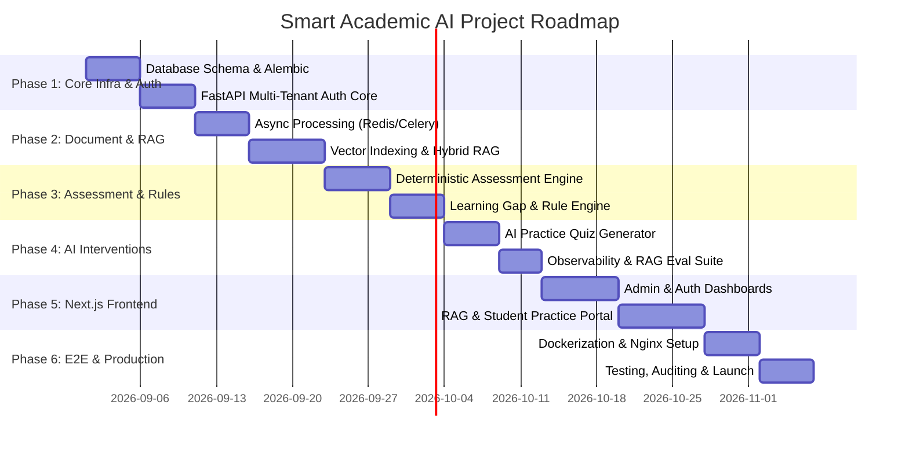

# Smart Academic AI - Implementation Plan & Roadmap

## 1. Execution Phases & Milestones

The development of Smart Academic AI is divided into 6 structured implementation phases.

---

## 2. Detailed Phase Breakdown

### Phase 1: Core Infrastructure, Multi-Tenancy & Auth
- **Deliverables**:
  - Local Docker Compose initialization with PostgreSQL 16 + `pgvector` extension and Redis.
  - Alembic migration scripts for core entities (`institutions`, `users`, `courses`, `classes`, `topics`, `enrollments`, `ai_request_logs`).
  - FastAPI application structure, config management (`pydantic-settings`), custom structured logging.
  - JWT Authentication (Bcrypt password hashing, access/refresh token pair), and `TenantContext` dependency injection.
- **Verification**: `pytest` covering tenant registration, user login, RBAC middleware, and tenant context isolation.

### Phase 2: Document Ingestion, Vectors & RAG Engine
- **Deliverables**:
  - Redis broker & Celery worker infrastructure setup.
  - Async file upload endpoint with path traversal & extension validation.
  - Document processing worker (PDF/DOCX text extraction, chunking with overlap).
  - Provider Abstraction (`BaseEmbeddingProvider`, `BaseLLMProvider`) & Gemini implementation adapters.
  - `pgvector` HNSW index & PostgreSQL full-text search (`tsvector`/`tsquery`) setup.
  - RAG Query endpoint with Reciprocal Rank Fusion (RRF) and citation generation.
- **Verification**: Unit tests for chunker, mocked embedding generator, integration test for hybrid RRF search.

### Phase 3: Assessment Engine & Deterministic Rule Engine
- **Deliverables**:
  - Assessment & Question schema management APIs.
  - Student Submission endpoints.
  - Deterministic evaluation engine (auto-grading MCQ and numerical questions, calculating scores/percentages, mapping results to course topics).
  - Rule-based Learning Gap detector (identifying topics where student score < mastery threshold).
- **Verification**: Deterministic test suite verifying score calculations and gap triggers without AI mocks.

### Phase 4: AI Interventions, Practice Quiz Generation & Observability
- **Deliverables**:
  - Async Celery task for personalized learning intervention summary generation.
  - Targeted practice quiz generator creating structured JSON quizzes tailored to detected gaps.
  - AI Observability logger (`ai_request_logs` tracking tokens, latency, cost).
  - RAG Evaluation Suite (`rag_evaluation_runs` evaluating hit rate, citation accuracy, context relevance, groundedness).
- **Verification**: `pytest` validating JSON schema enforcement, token tracking logging, and mock AI quiz generation pipeline.

### Phase 5: Next.js Frontend Development
- **Deliverables**:
  - Next.js 14 App Router layout, Tailwind CSS theme, and `shadcn/ui` component suite.
  - Auth context and JWT state management.
  - Institution Admin portal (User management, course and class creation).
  - Teacher dashboard (Document upload, assessment creation, class analytics with Recharts).
  - Student workspace (RAG document assistant, assessment portal, gap breakdown, practice quiz interface).
- **Verification**: Component testing, React Query caching checks, responsive layout testing.

### Phase 6: E2E Testing, Production Dockerization & Deployment
- **Deliverables**:
  - `docker-compose.yml` orchestrating FastAPI, Next.js, Postgres (pgvector), Redis, Celery workers, and Nginx.
  - Automated integration testing suite (`pytest` + Playwright/Cypress for E2E flows).
  - GitHub Actions CI/CD workflow building and running test suites.
- **Verification**: Zero broken tests, clean container startup, passing security scan.
