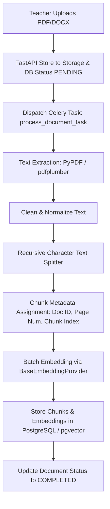

# Smart Academic AI - RAG & AI Architecture Specification

## 1. Overview & Objectives

The Retrieval-Augmented Generation (RAG) subsystem enables Smart Academic AI to deliver precise, citation-backed answers derived directly from uploaded course documents (lecture notes, textbooks, syllabus).

### Key Architectural Requirements:
1. **Zero-Hallucination Guardrails**: Answers must strictly cite source context. If context is insufficient, the system explicitly states it cannot answer.
2. **Multi-Tenant Vector Isolation**: Every vector query is filtered by `institution_id` and `course_id`.
3. **Provider Abstraction**: Decoupled LLM and Embedding abstractions allowing hot-swapping between Google Gemini, OpenAI, Anthropic, or local models.
4. **Async Ingestion Pipeline**: PDF/DOCX parsing and batch embedding creation execute out-of-band via Celery.
5. **Observability & Evaluation**: Integrated token cost/latency tracking and automated retrieval quality benchmarking.

---

## 2. Document Ingestion & Chunking Pipeline



### Chunking Parameters
- **Strategy**: Recursive Character Text Splitting (splits by `\n\n`, `\n`, `.`, ` `).
- **Chunk Size**: `768` tokens (~3000 characters).
- **Chunk Overlap**: `128` tokens (~500 characters) to preserve contextual boundaries.
- **Metadata Preserved**: `document_id`, `institution_id`, `course_id`, `page_number`, `chunk_index`, `file_type`.

---

## 3. Provider Abstraction Layer Design

To prevent vendor lock-in, all AI interactions inherit from generic abstract interfaces located in `app/services/ai/base.py`.

```python
# Base Interfaces (Conceptual Blueprint)
from abc import ABC, abstractmethod
from typing import List, Dict, Any, Optional
from pydantic import BaseModel

class LLMResponse(BaseModel):
    content: str
    input_tokens: int
    output_tokens: int
    raw_response: Optional[Dict[str, Any]] = None

class BaseEmbeddingProvider(ABC):
    @abstractmethod
    async def embed_text(self, text: str) -> List[float]:
        pass

    @abstractmethod
    async def embed_batch(self, texts: List[str]) -> List[List[float]]:
        pass

class BaseLLMProvider(ABC):
    @abstractmethod
    async def generate(
        self, 
        prompt: str, 
        system_prompt: Optional[str] = None, 
        temperature: float = 0.2
    ) -> LLMResponse:
        pass

    @abstractmethod
    async def generate_structured(
        self, 
        prompt: str, 
        response_schema: dict,
        system_prompt: Optional[str] = None
    ) -> Dict[str, Any]:
        pass
```

### Primary Provider Adapters:
- **Embedding Provider**: `GeminiEmbeddingProvider` (`models/text-embedding-004`, 768 dimensions).
- **LLM Provider**: `GeminiLLMProvider` (`gemini-1.5-flash` or `gemini-1.5-pro`).

---

## 4. Hybrid Retrieval & Reranking Architecture

Smart Academic AI uses **Hybrid Search** combining dense vector similarity (`pgvector`) with sparse lexical search using PostgreSQL Full-Text Search (`tsvector` / `tsquery`).

```
                        ┌───────────────────────────────┐
                        │        User Query             │
                        └──────────────┬────────────────┘
                                       │
                ┌──────────────────────┴──────────────────────┐
                ▼                                             ▼
  [ Dense Vector Search ]                 [ PostgreSQL Full-Text Search ]
  Cosine Similarity via pgvector          tsvector / tsquery + ts_rank_cd
  WHERE institution_id & course_id        WHERE institution_id & course_id
                │                                             │
                └──────────────────────┬──────────────────────┘
                                       ▼
                       [ Reciprocal Rank Fusion (RRF) ]
                       Score = 1/(60 + r_dense) + 1/(60 + r_sparse)
                                       │
                                       ▼
                       [ Top-K Context Chunks Selected ]
```

### Reciprocal Rank Fusion (RRF) SQL Query Pattern:
```sql
WITH vector_matches AS (
    SELECT id, content, page_number, document_id,
           ROW_NUMBER() OVER (ORDER BY embedding <=> :query_embedding) AS rank
    FROM document_chunks
    WHERE institution_id = :institution_id AND course_id = :course_id
    LIMIT 20
),
text_matches AS (
    SELECT id, content, page_number, document_id,
           ROW_NUMBER() OVER (ORDER BY ts_rank_cd(to_tsvector('english', content), plainto_tsquery('english', :query_text)) DESC) AS rank
    FROM document_chunks
    WHERE institution_id = :institution_id AND course_id = :course_id
      AND to_tsvector('english', content) @@ plainto_tsquery('english', :query_text)
    LIMIT 20
)
SELECT COALESCE(v.id, t.id) as chunk_id,
       COALESCE(v.content, t.content) as content,
       COALESCE(v.page_number, t.page_number) as page_number,
       COALESCE(v.document_id, t.document_id) as document_id,
       (COALESCE(1.0 / (60 + v.rank), 0.0) + COALESCE(1.0 / (60 + t.rank), 0.0)) AS rrf_score
FROM vector_matches v
FULL OUTER JOIN text_matches t ON v.id = t.id
ORDER BY rrf_score DESC
LIMIT :top_k;
```

---

## 5. RAG Prompt Engineering & Citation Enforcement

### System Prompt Template:
```
You are the Smart Academic AI assistant for an accredited educational institution.
Your job is to answer student and teacher questions accurately using ONLY the provided course reference contexts.

STRICT RULES:
1. Base your answer EXCLUSIVELY on the Context excerpts provided below.
2. For EVERY factual statement, add an in-text citation referencing the Source Document and Page Number, e.g., [Doc: Lecture_02.pdf, Page: 14].
3. If the context does not contain enough information to answer the question with 100% confidence, respond: "I cannot find sufficient information in the course materials to answer this question."
4. Do NOT introduce outside knowledge or unverified facts.

CONTEXT EXCERPTS:
{retrieved_chunks_text}
```

---

## 6. Deterministic vs AI Assessment Separation

Math, percentages, score accumulation, and threshold rules are executed in **Deterministic Python Logic**. The LLM is invoked strictly for qualitative output.

- **Deterministic Logic Engine**:
  - Auto-grading Multiple Choice Questions (MCQ) & Numerical questions.
  - Computing total score and percentage: `score_pct = (obtained / total) * 100`.
  - Topic mastery calculation & learning gap classification (e.g. topic score < 50% = HIGH severity gap).
- **AI Engine (LLM)**:
  - Personal intervention explanations.
  - Recommended study paths.
  - Targeted practice quiz item generation.

---

## 7. RAG Evaluation Module

Smart Academic AI includes a dedicated offline and online **RAG Evaluation Suite** (`app/services/ai/evaluator.py`).

### Key Metrics Evaluated:
1. **Retrieval Hit Rate**: Percentage of queries where expected ground-truth document chunks are retrieved in top-K.
2. **Citation Accuracy**: Verifying that cited `document_id` and `page_number` match the actual source chunks.
3. **Context Relevance**: Proportion of retrieved chunks relevant to the user query.
4. **Groundedness / Faithfulness**: Verifying that the LLM response contains zero statements unsupported by the retrieved context.

---

## 8. AI Observability & Cost Tracking

All AI calls are routed through an **Observability Decorator / Service** that logs metadata to `ai_request_logs`.

### Metrics Tracked per Call:
- `request_id`: Unique trace ID for the request cycle.
- `institution_id`: Tenant context.
- `provider`: `GEMINI`, `OPENAI`, etc.
- `model_name`: e.g. `gemini-1.5-flash`.
- `input_tokens` & `output_tokens`: Token consumption metrics.
- `latency_ms`: Total execution time in milliseconds.
- `estimated_cost_usd`: Calculated cost based on provider pricing tables.
